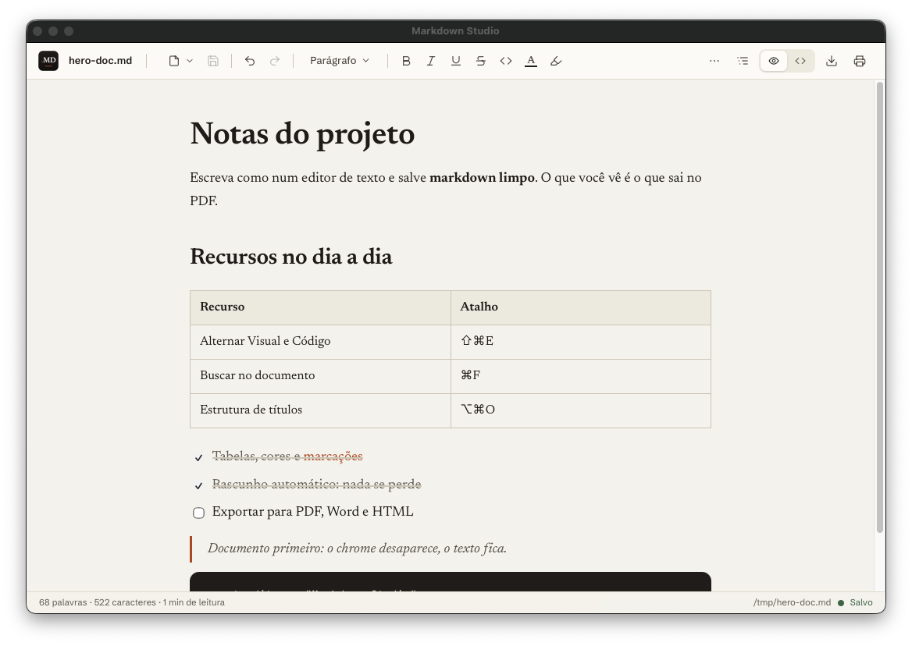

# Markdown Studio

Visualizador e editor de Markdown para macOS. Abra qualquer arquivo `.md` e veja um documento de verdade: renderizado, bonito e já editável. O que você salva é sempre markdown limpo.



## Por que existe

Abrir um arquivo markdown no Mac normalmente significa cair num editor de código ou num preview estático. O Markdown Studio trata o `.md` como documento: tipografia editorial, edição no estilo de um processador de texto e fidelidade total entre o que você vê, o que salva e o que exporta.

## Recursos

### Edição
- Modo Visual (padrão): edição rica com barra de ferramentas completa, como num editor de texto
- Modo Código: o markdown bruto num editor com numeração de linhas e busca própria, sincronizado com o Visual (alterne com ⇧⌘E)
- Formatação completa: títulos, negrito, itálico, sublinhado, tachado, código em linha, cores de texto, marca-texto, listas, listas de tarefas, citações, blocos de código, tabelas com menu de linhas e colunas, links, imagens e divisores
- Cores e sublinhado sobrevivem ao salvar: viram HTML em linha dentro do markdown, compatível com outros leitores

### Arquivos com segurança
- Rascunho automático de sessão: feche o app de qualquer jeito e reabra com tudo no lugar, incluindo alterações não salvas
- O disco é a verdade: se o arquivo mudar por fora (git pull, outro editor, um script), o app recarrega o documento limpo ou mostra um aviso de conflito com as opções "Recarregar do disco" e "Manter meu rascunho"
- Nenhuma escolha destrutiva: o rascunho descartado num conflito pode ser recuperado com ⇧⌘T, assim como abas fechadas
- Salvar nunca sobrescreve mudanças externas em silêncio: o app confere o disco antes de gravar

### Navegação e leitura
- Abas para vários arquivos (aparecem só quando há mais de um)
- Estrutura do documento (⌥⌘O): painel lateral com os títulos, clique para navegar
- Busca no documento (⌘F) com destaque de todas as ocorrências e contador
- Zoom do texto (⌘ mais, ⌘ menos, ⌘0), persistido entre sessões
- Arraste arquivos `.md` para a janela para abrir

### Exportação e impressão
- PDF, HTML, Word (DOCX) e RTF com a mesma tipografia do app (fontes embutidas no arquivo exportado)
- Impressão (⌘P) pelo diálogo nativo do macOS
- DOCX e RTF usam o conversor nativo do sistema (textutil); PDF usa um navegador Chromium se houver um instalado, com alternativa pelo diálogo de impressão

### Atalhos principais

| Ação | Atalho |
| --- | --- |
| Abrir arquivo | ⌘O |
| Novo documento | ⌘N |
| Salvar / Salvar como | ⌘S / ⇧⌘S |
| Alternar Visual e Código | ⇧⌘E |
| Buscar no documento | ⌘F |
| Estrutura do documento | ⌥⌘O |
| Fechar aba / reabrir aba | ⌘W / ⇧⌘T |
| Navegar entre abas | ⌘1 a ⌘9, ⌃Tab, ⇧⌘[ e ⇧⌘] |
| Zoom do texto | ⌘+, ⌘−, ⌘0 |
| Painel de atalhos | ⌘/ |

## Instalação

1. Baixe o arquivo `.dmg` da [última release](../../releases/latest)
2. Abra o `.dmg` e arraste o Markdown Studio para a pasta Aplicativos
3. O app é open source e não é assinado com certificado da Apple, então o macOS pede uma confirmação na primeira abertura:
   - macOS 14 ou anterior: clique com o botão direito no app e escolha "Abrir"
   - macOS 15 ou mais recente: tente abrir o app uma vez, depois vá em Ajustes do Sistema, Privacidade e Segurança, e clique em "Abrir Mesmo Assim"

Alternativa pelo Terminal (remove a quarentena do download):

```sh
xattr -cr "/Applications/Markdown Studio.app"
```

Se preferir, compile você mesmo a partir do código (seção Desenvolvimento abaixo): apps gerados localmente não passam pela quarentena.

Requisitos: macOS 12 ou superior, Apple Silicon ou Intel.

## Desenvolvimento

O projeto inteiro roda com [Bun](https://bun.sh): frontend, backend desktop e empacotamento.

```sh
git clone https://github.com/SEU_USUARIO/markdown-studio.git
cd markdown-studio
bun install        # também gera os arquivos derivados (fontes embutidas)
bun run dev        # API local na porta 4519 e Vite na 5173
```

Qualidade:

```sh
bun run typecheck  # TypeScript estrito
bun run lint       # Biome
bun run test       # Vitest (17 testes, incluindo roundtrip de markdown e fluxos de sessão)
```

Gerar o aplicativo:

```sh
bun run build:app  # produz "build/Markdown Studio.app"
```

## Arquitetura

```
.app
└── launcher → binário único (bun build --compile)
    ├── janela nativa WKWebView (webview-bun)
    └── Worker: servidor Bun em 127.0.0.1, porta aleatória, com token de sessão
        ├── frontend React embutido no binário (Vite, TipTap, CodeMirror)
        └── API local: arquivos, diálogos nativos, sessão, exportações
```

Pontos de interesse:

- A fonte da verdade é a string markdown; TipTap (Visual) e CodeMirror (Código) são visões sincronizadas
- A sessão (abas, conteúdo, rascunhos) é gravada com debounce em `~/Library/Application Support/MarkdownStudio/session.json`
- Exportações partem do mesmo HTML que o app renderiza, com CSS e fontes embutidos, garantindo fidelidade
- Stack: Bun, TypeScript estrito, React 19, Vite, Tailwind CSS 4, TipTap 2, CodeMirror 6, Vitest, Biome

## Limitações conhecidas

- Apenas macOS (a janela nativa, os diálogos e os conversores de exportação usam recursos do sistema)
- O app não é assinado nem notarizado; veja a seção de instalação
- A exportação direta para PDF depende de um navegador Chromium instalado; sem ele, o app abre o diálogo de impressão para salvar como PDF

## Licença

[MIT](LICENSE)
